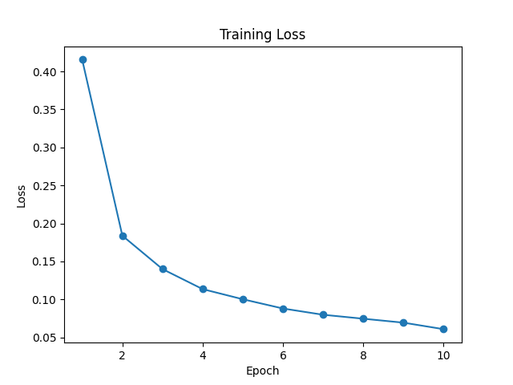

Shell output:
```
/r_d_GenAI/GenerativeAI/Lesson2/main.py
Using device: cpu
Epoch 1, Loss: 0.4155
Epoch 2, Loss: 0.1839
Epoch 3, Loss: 0.1399
Epoch 4, Loss: 0.1135
Epoch 5, Loss: 0.1002
Epoch 6, Loss: 0.0880
Epoch 7, Loss: 0.0798
Epoch 8, Loss: 0.0746
Epoch 9, Loss: 0.0694
Epoch 10, Loss: 0.0608
2024-11-28 22:30:19.732 Python[20650:1746031] +[IMKClient subclass]: chose IMKClient_Modern
2024-11-28 22:30:19.732 Python[20650:1746031] +[IMKInputSession subclass]: chose IMKInputSession_Modern
Accuracy on test data: 97.58%
```
### Visualization training loss


### Visualization confusion matrix


### Visualization of predictions
