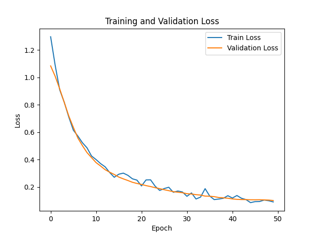

Для цієї задачі створимо нейронну мережу на прикладі класифікаційного набору даних - **Wine Dataset з бібліотеки sklearn**

Очікувані результати
---
- Точність на тестових даних має бути високою (близько 90% для цього набору даних).
- Втрати на навчальній та валідаційній вибірках мають збігатися після кількох епох, що свідчить про відсутність перенавчання.

Після навчання отримали наступний результат:
#### Training and Validation Loss

1. Точність на тестових даних. Досягнуто 100% точності, що вказує на те, що модель дуже добре впоралася з класифікацією. Це може свідчити про те, що модель добре узгоджується з даними (не перенавчена і не недонавчена).
2. Втрати на навчальній та валідаційній вибірках. Втрати поступово знижуються на обох вибірках, а валідаційні втрати стабільно зменшуються разом із навчальними. Це свідчить про те, що модель не перенавчається, а регуляризація (Dropout, L2-регуляризація) допомагає стабільно тренувати модель.
3. Графік втрат. На основі графіка видно, що після кількох епох навчальна та валідаційна втрата збігаються. Це означає, що модель стабільно узгоджується з даними.

### Висновки
Результати перевищують очікувані:
- Досягнуто точності 100% на тестовій вибірці.
- Регуляризація та обрана архітектура моделі добре працюють.
- Графік втрат підтверджує, що модель не перенавчається.